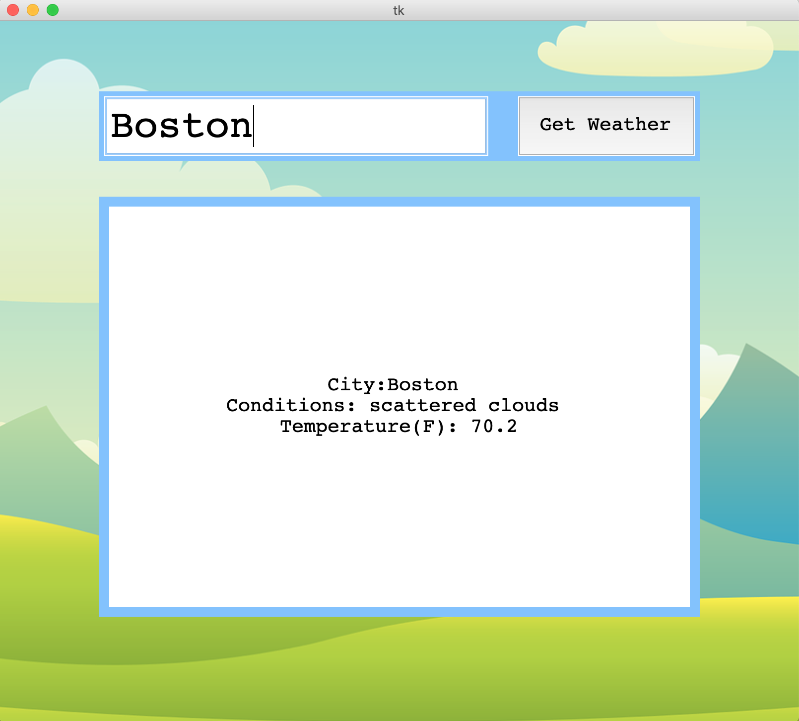

# WeatherApp

Weather Application with graphical User Interface using Tkinter library. 

### Prerequisites:

  ```
  python3
  pip3 install requests
  pip3 install Pillow

  ```
### Weather API URL

1. Go to url : https://openweathermap.org/forecast5
2. Sign up and click API keys
3. Copy that key in code use as APPID in your code

### GUI Output




  

